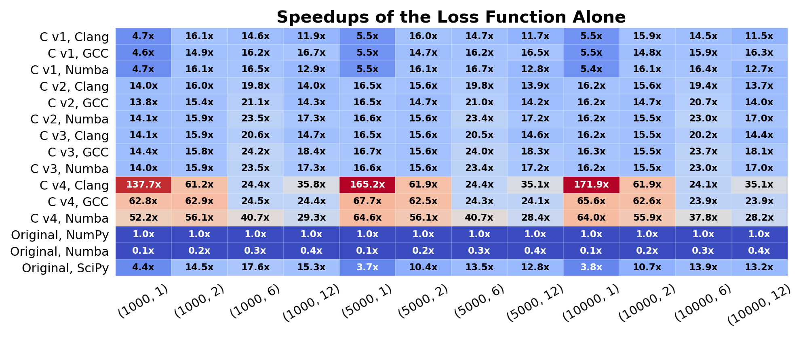
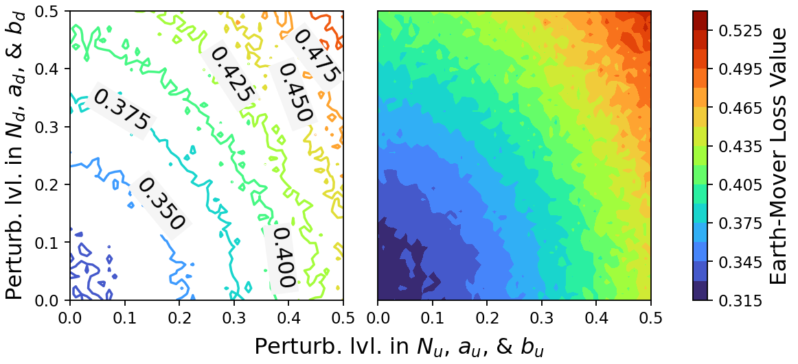
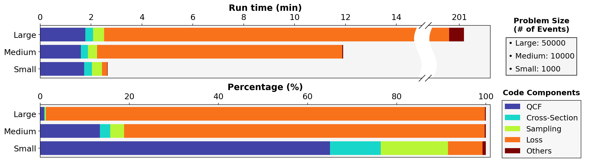
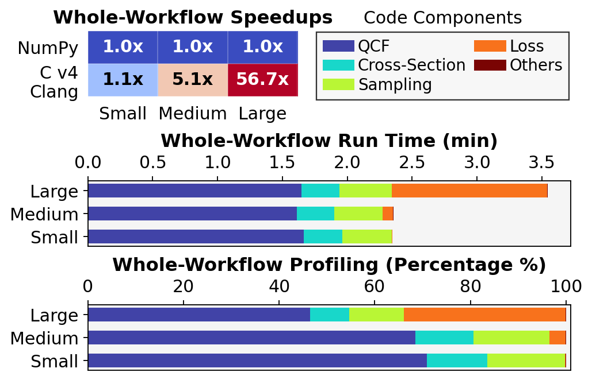
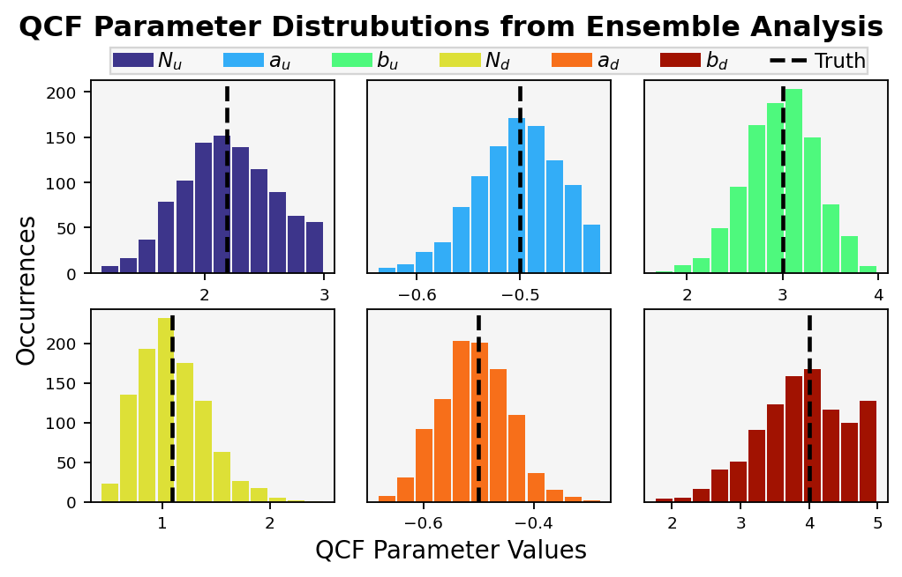

Self-contained reproducibility package for the following poster:
> P.-Y. Chuang, N. Shah, A. Attia, E. Constantinescu, & W. Feng (2023). A Recipe
> for Transforming High-Productivity DSL Code into High-Performance Code for
> Exascale Systems. _2023 SciDAC PI Meeting_

#### Disclaimer

The results are mostly computational performance. Thererfore, using different
hardware may give different values on the figures.

#### License Notice

No license. Except for GitHub's implicit permissions, all other uses of this
repository require explicit permission granted from the author.

## Preparation

Most of dependencies can be managed by Anaconda or its derived tools. Assuming
under the top-level repository directory, create an environment named
`scoring-test` with the command in the terminal:
```shell
conda env create -n scoring-test -f environment.yaml
```

And then get into this conda environment:
```shell
conda activate scoring-test
```

Now we need to compile C-extensions needed. This requires both GCC and Clang
compilers because we will also compare the two compilers' performances. Once
having the GCC and Clang compiler on the host computer, do
```shell
source build.sh
```

Lastly, we need to create the training data (i.e., mock experimental data). Do
```shell
python data_generator.py surface
python data_generator.py training
```
The data will be saved to a folder called `data`.

## Speedups of the loss function alone

This steps will create the figure as below:
<center></center>

First, do the calculation to obtain the results:
```shell
mpiexec -n <NPROCS> python earth_mover_perf.py
```
`<NPROCS>` is the wanted number of MPI tasks. Note that this is a single-core
profiling, so when launching the MPI tasks, make sure they are properly
configured so that tasks do not interfere with others. Also, several of the
single-core target functions require as much as 30G of memory.

To save the hassle, you can use the script `earth_mover_perf.sh` to submit the
calculation to a Slurm-based cluster. The resources (task topology, memory, etc)
are pre-configured, but you may still need to edit it according to the actual
configuration of the cluster.

Then, create the figure with
```shell
python postprocess_1.py
```
The figure will be saved to `images/earth_mover_speedups.png`

## Surface of the loss function

The steps will create the following figure
<center></center>

This step is not parallelized by MPI but just the built-in `multiprocessing`. Do
```shell
python earth_mover_surface.py <NPROCS>
```
That being said, this Python script only works on a single node, and `<NPROCS>`
cannot exceed what this single node has.

Once the calculation is done, create the figure with
```shell
python postprocess_2.py
```
The figure will be saved to `images/earth_mover_surface.png`

## Whole-workflow profiling before and after optimizing the loss

This step will create the following two figures
<center></center>
and
<center></center>

Do the calculations one-by-one with
```shell
python stats_workflow_perf.py small numpy
python stats_workflow_perf.py small c
python stats_workflow_perf.py medium numpy
python stats_workflow_perf.py medium c 
python stats_workflow_perf.py large c 
python stats_workflow_perf.py large numpy 
```
Note that `python stats_workflow_perf.py large numpy ` needs about 80G of memory
and takes about 3.5 hours to finish on AMD EPYC 7702. Or, you can use the script
`stats_workflow_perf.sh` to submit a batch job to a Slurm-based cluster. Again,
the resources are pre-configured, but you still need to edit it accordingly.

Once the calculations are done, create the figures with
```shell
python postprocess_3.py
python postprocess_4.py
```
The figures will be saved to `images/profiling_before.png` and
`images/overall_speedups.png`.

## Ensembel analysis

This steps will create the following figure:
<center></center>

This calculation is parallelized with MPI. Do
```shell
mpiexec -n <NPROCS> python stats_workflow_uq.py
```
Again, `<NPROCS>` denotes the number of MPI processes wanted. It took about 70
minutes with 512 CPUs (AMD EPYC 7702). Alternatively, the script
`stats_workflow_uq.sh` can be used for a Slurm-based cluster. It needs to be
edited according to the cluster's configuration.

Once the calculation is done, do
```shell
python postprocess_5.py
```
The figure will be saved to `images/ensemble_analysis.png`.

## Contact

Pi-Yueh Chuang <pychuang@vt.edu>